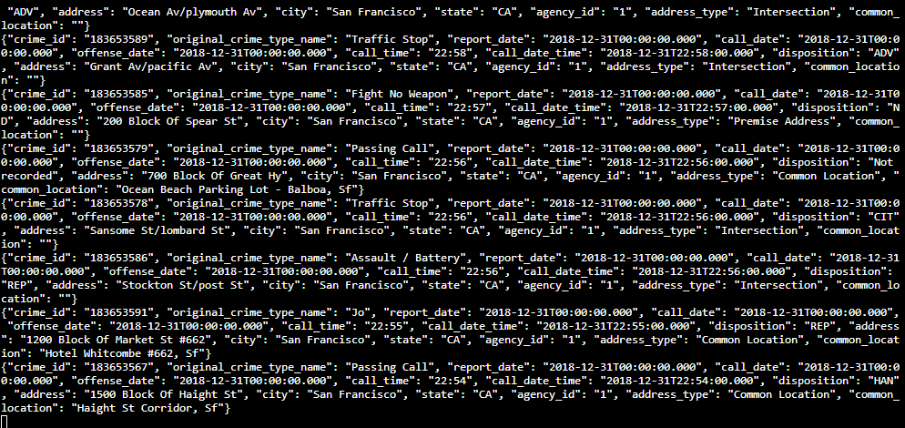
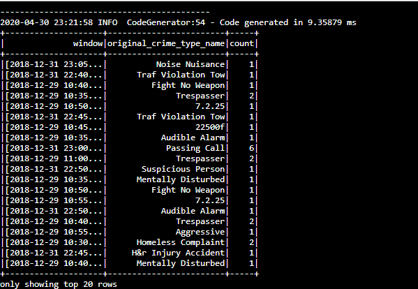

# San Francisco Crime Data Project
***
This project works with a given dataset, extracted from Kaggle, on San Francisco crime incidents, and you will provide statistical analyses of the data using Apache Spark Structured Streaming.

## Content:

* ```producer_server.py```
* ```kafka_server.py```
* ```data_stream.py```
* ```consumer_asyncio.py```
* ```police-department-calls-for-service.json```
* ```radio_code.json```
* ```start.sh```
* ```requirements.txt```
* screenshots
  * ```output.png```
  * ```raw_data_output.png```
  * ```spark_jobs_01.png```
  * ```spark_jobs_02.png```
  * ```spark_jobs_03.png```
* config
   * ```server.properties```
   * ```zookeeper.properties```

## Instructions:
****

### Environment:
___ 
* Spark 2.4.3
* Scala 2.11.x
* Java 1.8.x
* Kafka build with Scala 2.11.x
* Python 3.6.x or higher

#### Setup:
***

1. Install the requierments from the ```requirements.txt```
   * use the ```start.sh```for conda
   * use `python -m pip install requirements.txt` for Python  


2. Modifiy the ```zookeeper.properties``` and the ```server.properties```
   * Setup the portnumber in both files.
   * Type `bin/zookeeper-server-start.sh config/zookeeper.properties` in a terminal to start the Zookeeper Server
   * type `bin/kafka-server-start.sh config/server.properties`in another terminal to start the Kafka Server

3. Execute the ```kafka_server.py```

4. Test the Kafka Producer.
   * Run `kafka-console-consumer.sh --bootstrap-server localhost:<your-port-number> --topic <your-topic-name> --from-beginning` in a terminal.
   * Alternative you can execute the ```consumer_asyncio.py```
***
###### If the server work correctly you schould see somethink like this:




5. Submit the Spark job
   * Type `spark-submit --packages org.apache.spark:spark-sql-kafka-0-10_2.11:2.3.4 --master local[*] data_stream.py` in a terminal.
***
###### Output :


***
6. Control the Saprk Jobs via Spark UI
   * open in your Browser localhost:4040 to enter in the Spark UI
   
   


***
#### Question 1

> How did changing values on the SparkSession property parameters affect the throughput and latency of the data?

The metric tracked was processedRowsPerSecond and it either decreased and increased.

#### Question 2

> What were the 2-3 most efficient SparkSession property key/value pairs? Through testing multiple variations on values, how can you tell these were the most optimal?

* maxRatePerPartition
* spark.default.parallelism
* spark.Executer.Memory

